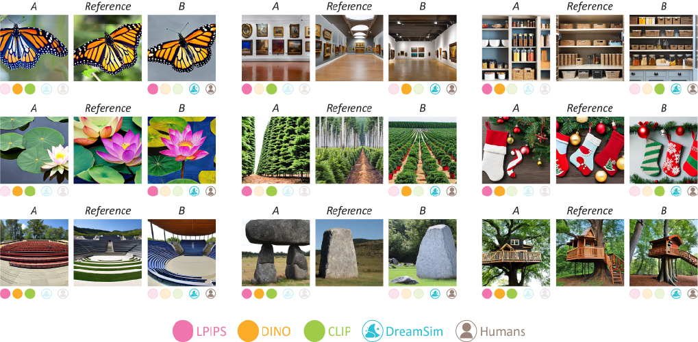

<!-- #   DreamSim Perceptual Metric -->
<!-- # DreamSim Perceptual Metric   -->
# DreamSim: Learning New Dimensions of Human Visual Similarity using Synthetic Data
### [Project Page](https://dreamsim-nights.github.io/) | [Paper](https://arxiv.org/abs/2306.09344) | [Bibtex](#bibtex)
[](https://colab.research.google.com/drive/1taEOMzFE9g81D9AwH27Uhy2U82tQGAVI?usp=sharing)

[Stephanie Fu](https://stephanie-fu.github.io)\* $^{1}$, [Netanel Tamir](https://netanel-tamir.github.io)\* $^{2}$, [Shobhita Sundaram](https://ssundaram21.github.io)\* $^{1}$, [Lucy Chai](https://people.csail.mit.edu/lrchai/) $^1$, [Richard Zhang](http://richzhang.github.io) $^3$, [Tali Dekel](https://www.weizmann.ac.il/math/dekel/) $^2$, [Phillip Isola](https://web.mit.edu/phillipi/) $^1$.<br>
(*equal contribution, order decided by random seed)<br>
$^1$ MIT, $^2$ Weizmann Institute of Science, $^3$ Adobe Research.



**Summary**

Current metrics for perceptual image similarity operate at the level of pixels and patches. These metrics compare images in terms of their low-level colors and textures, but fail to capture mid-level differences in layout, pose, semantic content, etc. Models that use image-level embeddings such as DINO and CLIP capture high-level and semantic judgements, but may not be aligned with human perception of more finegrained attributes.

DreamSim is a new metric for perceptual image similarity that bridges the gap between "low-level" metrics (e.g. LPIPS, PSNR, SSIM) and "high-level" measures (e.g. CLIP). Our model was trained by concatenating CLIP, OpenCLIP, and DINO embeddings, and then finetuning on human perceptual judgements. We gathered these judgements on a dataset of ~20k image triplets, generated by diffusion models. Our model achieves better alignment with human similarity judgements than existing metrics, and can be used for downstream applications such as image retrieval.

## 🚀 Newest Updates
**10/14/24:** We released 4 new variants of DreamSim! These new checkpoints are:
- DINOv2 B/14 and SynCLR B/16 as backbones
- DINOv2 B/14 and DINO B/16 trained with the original contrastive loss on both CLS and dense features.
  - To extract features from the model variant trained through both the CLS and patch features, set `use_patch_model=True` when calling `dreamsim()`.

These models (and the originals) are further evaluated in **our new NeurIPS 2024 paper, [When Does Perceptual Alignment Benefit Vision Representations?](https://arxiv.org/abs/2410.10817)**

We find that our perceptually-aligned representations outperform the baseline models on a variety of standard computer vision tasks, including semantic segmentation, depth estimation, object counting, instance retrieval, and retrieval-augmented generation. These results point towards perceptual alignment as a useful objective for learning general-purpose vision representations. See the paper and our [blog post](https://percep-align.github.io) 
for more details.

Here's the updated NIGHTS performance table:
|                   | NIGHTS - Val | NIGHTS - Test |
|-------------------|--------------|---------------|
| `ensemble`        |       96.9%       |     96.2%     |
| `dino_vitb16`     |        95.6%      |       94.8%      |
| `open_clip_vitb32`     |     95.6%         |     95.3%    |
| `clip_vitb32`|      94.9%        |     93.6%       |
| `dinov2_vitb14`     |      94.9%        |    95.0%     |
| `synclr_vitb16`|       96.0%       |      95.9%      |
| `dino_vitb16 (patch)`     |      94.9%        |   94.8%     |
| `dinov2_vitb14 (patch)`|     95.5%         |      95.1%      |

**9/14/24:** We released new versions of the ensemble and single-branch DreamSim models compatible with `peft>=0.2.0`.

We also released the entire [100k (unfiltered) NIGHTS dataset](#new-download-the-entire-100k-pre-filtered-nights-dataset) and the [JND (Just-Noticeable Difference) votes](#new-download-the-jnd-data).

## Table of Contents
* [Requirements](#requirements)
* [Setup](#setup)
* [Usage](#usage)
  * [Quickstart](#quickstart-perceptual-similarity-metric)
  * [Single-branch models](#single-branch-models)
  * [Feature extraction](#feature-extraction)
  * [Image retrieval](#image-retrieval)
  * [Perceptual loss function](#perceptual-loss-function)
* [NIGHTS Dataset](#nights-novel-image-generations-with-human-tested-similarities-dataset)
* [Experiments](#experiments)
* [Citation](#citation)

## Requirements
- Linux
- Python 3

## Setup

**Option 1:** Install using pip: 

```pip install dreamsim```

The package is used for importing and using the DreamSim model.

**Option 2:** Clone our repo and install dependencies.
This is necessary for running our training/evaluation scripts.

```
python3 -m venv ds
source ds/bin/activate
pip install -r requirements.txt
export PYTHONPATH="$PYTHONPATH:$(realpath ./dreamsim)"
```
To install with conda:
```
conda create -n ds
conda activate ds
conda install pip # verify with the `which pip` command
pip install -r requirements.txt
export PYTHONPATH="$PYTHONPATH:$(realpath ./dreamsim)"
```

## Usage
**For walk-through examples of the below use-cases, check out our [Colab demo](https://colab.research.google.com/drive/1taEOMzFE9g81D9AwH27Uhy2U82tQGAVI?usp=sharing).**

### Quickstart: Perceptual similarity metric
The basic use case is to measure the perceptual distance between two images. **A higher score means more different, lower means more similar**. 

The following code snippet is all you need. The first time that you run `dreamsim` it will automatically download the model weights. The default model settings are specified in `./dreamsim/config.py`. **To extract features from the model variant trained through both the CLS and patch features, set `use_patch_model=True` when calling `dreamsim()`.**
```
from dreamsim import dreamsim
from PIL import Image

device = "cuda"
model, preprocess = dreamsim(pretrained=True, device=device)

img1 = preprocess(Image.open("img1_path")).to(device)
img2 = preprocess(Image.open("img2_path")).to(device)
distance = model(img1, img2) # The model takes an RGB image from [0, 1], size batch_sizex3x224x224
```

To run on example images, run `demo.py`. The script should produce distances (0.4453, 0.2756). 

### Single-branch models
By default, DreamSim uses an ensemble of CLIP, DINO, and OpenCLIP (all ViT-B/16). If you need a lighter-weight model you can use *single-branch* versions of DreamSim where only a single backbone is finetuned. **The single-branch models provide a ~3x speedup over the ensemble.**

The available options are OpenCLIP-ViTB/32, DINO-ViTB/16, CLIP-ViTB/32, in order of performance. To load a single-branch model, use the `dreamsim_type` argument. For example:
```
dreamsim_dino_model, preprocess = dreamsim(pretrained=True, dreamsim_type="dino_vitb16")
```

### Feature extraction
To extract a *single image embedding* using dreamsim, use the `embed` method as shown in the following snippet:
```
img1 = preprocess(Image.open("img1_path")).to("cuda")
embedding = model.embed(img1)
```
The perceptual distance between two images is the cosine distance between their embeddings. If the embeddings are normalized (true by default) L2 distance can also be used.


### Image retrieval
Our model can be used for image retrieval, and plugged into existing such pipelines. The code below ranks a dataset of images based on their similarity to a given query image. 

To speed things up, instead of directly calling `model(query, image)` for each pair, we use the `model.embed(image)` method to pre-compute single-image embeddings, and then take the cosine distance between embedding pairs.
```
import pandas as pd
from tqdm import tqdm
import torch.nn.functional as F

# let query be a sample image.
# let images be a list of images we are searching.

# Compute the query image embedding
query_embed = model.embed(preprocess(query).to("cuda"))
dists = {}

# Compute the (cosine) distance between the query and each search image
for i, im in tqdm(enumerate(images), total=len(images)):
   img_embed = model.embed(preprocess(im).to("cuda"))
   dists[i] = (1 - F.cosine_similarity(query_embed, img_embed, dim=-1)).item()

# Return results sorted by distance
df = pd.DataFrame({"ids": list(dists.keys()), "dists": list(dists.values())})
return df.sort_values(by="dists")
```

### Perceptual loss function
Our model can be used as a loss function for iterative optimization (similarly to the LPIPS metric). These are the key lines; for the full example, refer to the [Colab](https://colab.research.google.com/drive/1taEOMzFE9g81D9AwH27Uhy2U82tQGAVI?usp=sharing).
```
for i in range(n_iters):
    dist = model(predicted_image, reference_image)
    dist.backward()
    optimizer.step()
```
<!--Experiments-->
## NIGHTS (Novel Image Generations with Human-Tested Similarities) Dataset
DreamSim is trained by fine-tuning on the NIGHTS dataset. For details on the dataset structure and creation, refer to the [dataset page](https://github.com/ssundaram21/dreamsim/tree/main/dataset).

Run `./dataset/download_dataset.sh` to download and unzip the NIGHTS dataset into `./dataset/nights`. The unzipped dataset size is 58 GB. 

Having trouble with the large file sizes? Run `./dataset/download_chunked_dataset.sh` to download the NIGHTS dataset split into 200 smaller zip files. The output of this script is identical to `download_dataset.sh`.

### (new!) Download the entire 100k pre-filtered NIGHTS dataset
We only use the 20k unanimous triplets for training and evaluation, but release all 100k triplets (many with few and/or split votes) for research purposes. Run `./dataset/download_unfiltered_dataset.sh` to download and unzip this unfiltered version of the NIGHTS dataset into `./dataset/nights_unfiltered`. The unzipped dataset size is 289 GB.

### (new!) Download the JND data
Download the just-noticeable difference (JND) votes by running `./dataset/download_jnd_dataset.sh`. The CSV will be downloaded to `./dataset/jnd_votes.csv`. Check out the [Colab](https://colab.research.google.com/drive/1taEOMzFE9g81D9AwH27Uhy2U82tQGAVI?usp=sharing) for an example of loading a JND trial.

### Visualize NIGHTS and embeddings with the [Voxel51](https://github.com/voxel51/fiftyone) demo:
[![FiftyOne](https://img.shields.io/badge/FiftyOne-blue.svg?logo=data:image/svg+xml;base64,PD94bWwgdmVyc2lvbj0iMS4wIiBlbmNvZGluZz0idXRmLTgiPz4KPCEtLSBHZW5lcmF0b3I6IEFkb2JlIElsbHVzdHJhdG9yIDI3LjMuMSwgU1ZHIEV4cG9ydCBQbHVnLUluIC4gU1ZHIFZlcnNpb246IDYuMDAgQnVpbGQgMCkgIC0tPgo8c3ZnIHZlcnNpb249IjEuMSIgaWQ9IkxheWVyXzEiIHhtbG5zPSJodHRwOi8vd3d3LnczLm9yZy8yMDAwL3N2ZyIgeG1sbnM6eGxpbms9Imh0dHA6Ly93d3cudzMub3JnLzE5OTkveGxpbmsiIHg9IjBweCIgeT0iMHB4IgoJIHZpZXdCb3g9IjAgMCA1MjAuNyA0NzIuNyIgc3R5bGU9ImVuYWJsZS1iYWNrZ3JvdW5kOm5ldyAwIDAgNTIwLjcgNDcyLjc7IiB4bWw6c3BhY2U9InByZXNlcnZlIj4KPHN0eWxlIHR5cGU9InRleHQvY3NzIj4KCS5zdDB7ZmlsbDojRkY2RDAwO30KCS5zdDF7ZmlsbDojOUI5QjlCO30KPC9zdHlsZT4KPGcgaWQ9InN1cmZhY2UxIj4KCTxwYXRoIGNsYXNzPSJzdDAiIGQ9Ik0xMjAuOSw0My4yYzAtMi4yLDEuMy0zLjUsMi4yLTMuOGMwLjYtMC4zLDEuMy0wLjYsMi4yLTAuNmMwLjYsMCwxLjYsMC4zLDIuMiwwLjZsMTMuNyw4TDE2Ny42LDMybC0yNi44LTE1LjMKCQljLTkuNi01LjQtMjEuMS01LjQtMzEsMGMtOS42LDUuOC0xNS4zLDE1LjctMTUuMywyNi44djI4Ni4zbDI2LjIsMTUuM3YtMzAyaDAuMlY0My4yeiIvPgoJPHBhdGggY2xhc3M9InN0MCIgZD0iTTEyNy45LDQyOS42Yy0xLjksMS0zLjgsMC42LTQuNSwwYy0xLTAuNi0yLjItMS42LTIuMi0zLjh2LTE1LjdMOTUsMzk0Ljd2MzFjMCwxMS4yLDUuOCwyMS4xLDE1LjMsMjYuOAoJCWM0LjgsMi45LDEwLjIsNC4yLDE1LjMsNC4yYzUuNCwwLDEwLjUtMS4zLDE1LjMtNC4yTDQwMiwzMDEuN3YtMzAuNEwxMjcuOSw0MjkuNnoiLz4KCTxwYXRoIGNsYXNzPSJzdDAiIGQ9Ik00NzIuNCwyMDcuOGwtMjQ4LTE0My4ybC0yNi41LDE1TDQ1OSwyMzAuNWMxLjksMS4zLDIuMiwyLjksMi4yLDMuOHMtMC4zLDIuOS0yLjIsMy44bC0xMS44LDYuN3YzMC40CgkJbDI0LjktMTQuNGM5LjYtNS40LDE1LjMtMTUuNywxNS4zLTI2LjhDNDg3LjcsMjIzLjEsNDgyLDIxMy4yLDQ3Mi40LDIwNy44eiIvPgoJPHBhdGggY2xhc3M9InN0MSIgZD0iTTc5LjcsMzY4LjVsMjIuNywxMy4xbDI2LjIsMTUuM2w3LjcsNC41bDUuNCwzLjJsOTUuNS01NS4zdi05NS4yYzAtMTIuMSw2LjQtMjMuMywxNi45LTI5LjRsODIuNC00Ny42CgkJTDE5MC4yLDkyLjhsLTIyLjctMTMuMWwyMi43LTEzLjFsMjYuMi0xNS4zbDcuNy00LjVsNy43LDQuNWwxNjEsOTMuM2wzLjItMS45YzkuMy01LjQsMjEuMSwxLjMsMjEuMSwxMi4xdjMuOGwxNSw4LjZWMTQyCgkJYzAtMTIuNS02LjctMjQtMTcuMy0zMEwyNTQuNSwxOS4zYy0xMC45LTYuNC0yNC02LjQtMzQuOCwwTDEzNiw2Ny42djMwMy4ybC0yMi43LTEzLjFMODcsMzQyLjNsLTcuMy00LjJ2LTIzOGwtMjAuMSwxMS41CgkJYy0xMC45LDYuMS0xNy4zLDE3LjYtMTcuMywzMHYxODVjMCwxMi41LDYuNywyNCwxNy4zLDMwTDc5LjcsMzY4LjV6Ii8+Cgk8cGF0aCBjbGFzcz0ic3QxIiBkPSJNNDE3LjEsMjIzLjh2OTQuOWMwLDEyLjEtNi40LDIzLjMtMTYuOSwyOS40bC0xNDEuOSw4Mi4xYy05LjMsNS40LTIxLjEtMS4zLTIxLjEtMTIuMXYtMy44TDE5Ny45LDQzNwoJCWwyMS43LDEyLjVjMTAuOSw2LjQsMjQsNi40LDM0LjgsMEw0MTQuNiwzNTdjMTAuOS02LjQsMTcuMy0xNy42LDE3LjMtMzB2LTk0LjZMNDE3LjEsMjIzLjh6Ii8+CjwvZz4KPC9zdmc+Cg==)](https://try.fiftyone.ai/datasets/nights/samples)

## Experiments

### Download resources
Run `./training/download_models.sh` to download and unzip necessary ViT checkpoints (for CLIP, OpenCLIP, and MAE) into `./models`. 

### Training
To finetune a perceptual model on the dataset, run `./training/train.py`. For example, to finetune an ensemble of DINO, CLIP, and OpenCLIP using LoRA, run:

```
python ./training/train.py --config ./configs/train_ensemble_model_lora.yaml
```

We provide more sample configs in `./configs`, including examples of finetuning with LoRA and with an MLP head. See `./training/train.py` for a full list and description of training options.

### Evaluation
To evaluate a perceptual model on the dataset, run `./evaluation/eval_percep.py`. For example, to evaluate a trained checkpoint against a baseline model on the dataset, run:

```
python ./evaluation/eval_percep.py --config ./configs/eval_ensemble.yaml
```

See `./evaluate/eval_percep.py` for a full list and description of evaluation options.
<!--Experiments-->

<a name="bibtex"></a>
## Citation

If you find our work or any of our materials useful, please cite our papers:
```
@misc{fu2023dreamsim,
      title={DreamSim: Learning New Dimensions of Human Visual Similarity using Synthetic Data}, 
      author={Stephanie Fu and Netanel Tamir and Shobhita Sundaram and Lucy Chai and Richard Zhang and Tali Dekel and Phillip Isola},
      year={2023},
      eprint={2306.09344},
      archivePrefix={arXiv},
      primaryClass={cs.CV}
}
```
```
@misc{sundaram2024doesperceptualalignmentbenefit,
      title={When Does Perceptual Alignment Benefit Vision Representations?}, 
      author={Shobhita Sundaram and Stephanie Fu and Lukas Muttenthaler and Netanel Y. Tamir and Lucy Chai and Simon Kornblith and Trevor Darrell and Phillip Isola},
      year={2024},
      eprint={2410.10817},
      archivePrefix={arXiv},
      primaryClass={cs.CV},
      url={https://arxiv.org/abs/2410.10817}, 
}
```

## Acknowledgements
Our code borrows from the ["Deep ViT Features as Dense Visual Descriptors"](https://dino-vit-features.github.io/) repository for ViT feature extraction, and takes inspiration from the [UniverSeg](https://github.com/JJGO/UniverSeg) respository for code structure.

